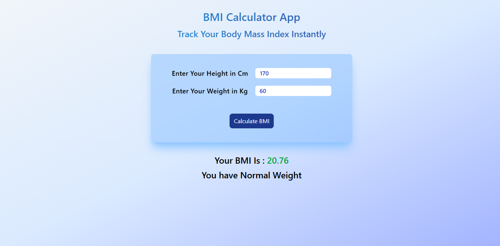

# 🚀 BMI Calculator

A simple and responsive BMI Calculator built using React with a modular component-based approach.

The application allows users to enter their height and weight, calculate their BMI, and view the corresponding result through a clean and intuitive interface.

---

## ✨ Features

✅ Enter height and weight

✅ Calculate BMI dynamically

✅ Display calculated BMI result

✅ Modular component structure

✅ Responsive user interface

---

## 🛠️ Technologies Used

| **Category** | **Technologies Used** |
| ------------ | --------------------- |
| ⚛️ Frontend  | React.js              |
| 🧠 Language  | JavaScript (ES6+)     |
| 🎨 Styling   | CSS                   |

---

## 📂 Project Structure

```text
.
└── BMI Caclulator App/
    ├── src/
    │   ├── App.jsx
    │   ├── App.css
    │   ├── InputField.jsx
    │   ├── BMICalculator.jsx
    │   ├── BMIResult.jsx
    │   ├── index.css
    │   └── main.jsx
    ├── .gitignore
    ├── README.md
    ├── index.html
    ├── eslint.config.js
    ├── vite.config.js
    ├── package-lock.json
    └── package.json
```

---

## 🧠 What I Learnt

This project helped practice and strengthen understanding of:

- Functional Components
- useState Hook
- Controlled Inputs
- Event Handling
- Component-Based Architecture
- Modular React Development
- Conditional Rendering
- Dynamic UI Updates
- Handling User Input

---

## ⚡ Installation and Setup

```bash
### Clone the repository

git clone <your-repository-url>

### Navigate into the project

cd BMI\ Calculator\ App

### Install dependencies

npm install

### Start development server

npm run dev
```

---

## 📸 Preview


