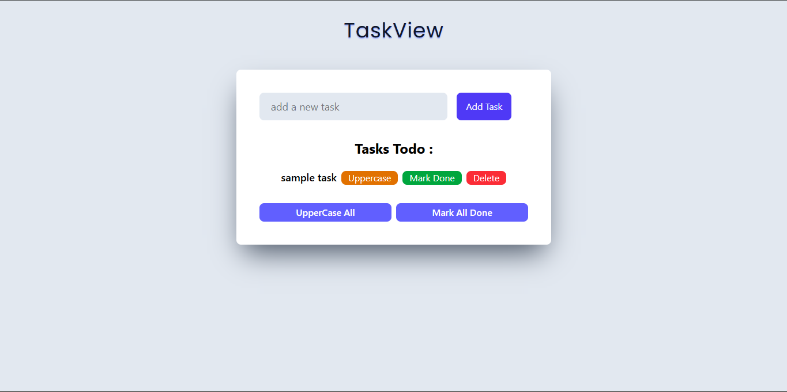
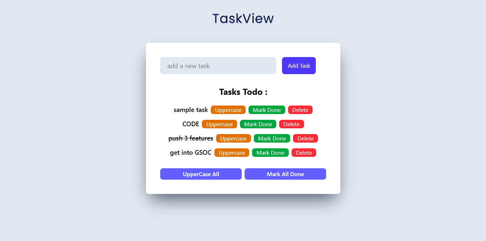

# 🚀 TaskView

A modern and responsive task management application built using React and Tailwind CSS.

TaskView allows users to create, manage, update, and track daily tasks with a clean and minimal user interface.

---

## ✨ Features

✅ Add new tasks dynamically  
✅ Delete tasks instantly  
✅ Mark individual tasks as completed  
✅ Mark all tasks as completed  
✅ Convert individual tasks to uppercase  
✅ Convert all tasks to uppercase  
✅ Controlled input handling

## 🛠️ Technologies Used

| Category    | Technologies Used |
| ----------- | ----------------- |
| ⚛️ Frontend | React.js          |
| 🎨 Styling  | Tailwind CSS      |
| 🧠 Language | JavaScript (ES6+) |

## 📂 Project Structure

```bash
.
└── TaskView App/
    ├── public
    ├── src/
    │   ├── assets
    │   ├── app.jsx
    │   ├── app.css
    │   ├── index.css
    │   ├── main.jsx
    │   └── TodoList.jsx
    ├── index.html
    ├── README.md
    ├── package.json
    └── vite.config.js
```

---

## 🧠 What I Learnt

This project helped practice and strengthen understanding of:

- Functional Components
- useState Hook
- Controlled Inputs
- Event Handling
- Conditional Rendering
- Array Methods
  - map()
  - filter()
- Immutable State Updates
- Dynamic List Rendering
- Component-Based Architecture

---

## 🎨 UI/UX Improvements

The UI was redesigned using modern frontend design principles:

- Consistent spacing system
- Minimal color palette
- Card-based layout
- Visual hierarchy

---

## ⚡ Installation and Setup

```bash
### Clone the repository

git clone <your-repository-url>

### Navigate into the project

cd TaskView App

### Install dependencies

npm install
npm install tailwindcss @tailwindcss/vite
npm install uuid

### Start development server

npm run dev

```

---

## 📸 Preview




---
