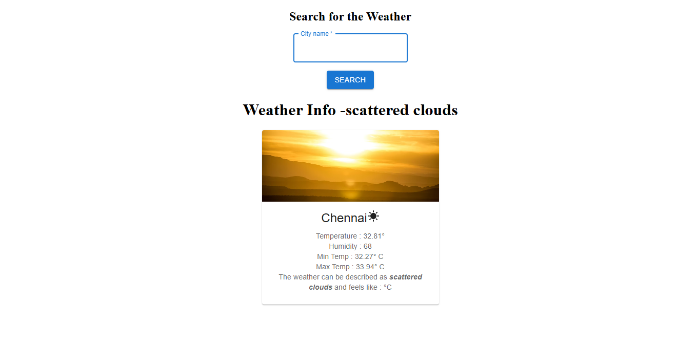
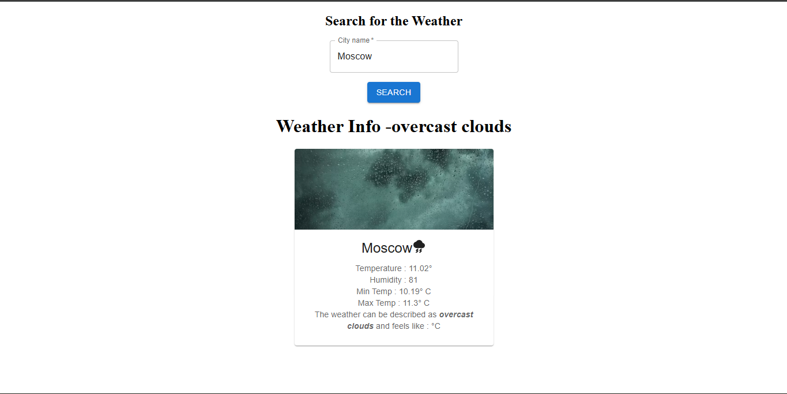

# 🌦️ React Weather App

A modern weather application built using **React.js** and **Material UI**, capable of fetching real-time weather data for any city using a weather API.
The app provides users with clean weather insights such as temperature, humidity, min/max temperature, and weather conditions through a responsive and visually appealing interface.

---

## Weather Search Interface

- Search weather information by entering any city name.
- Dynamic weather cards update based on API responses.
- Different visuals displayed according to weather conditions.

---

## 🚀 Features

- ✅ Search weather details for any city
- ✅ Real-time weather data fetching using API calls
- ✅ Displays:
  - Temperature
  - Humidity
  - Minimum Temperature
  - Maximum Temperature
  - Weather Description
  - Feels Like Temperature
- ✅ Dynamic weather imagery based on conditions
- ✅ Responsive and clean UI
- ✅ Built using reusable React components
- ✅ Material UI integration for professional styling

---

## 🛠️ Tech Stack

| Technology        | Purpose               |
| ----------------- | --------------------- |
| React.js          | Frontend Library      |
| JavaScript (ES6+) | Logic & Functionality |
| Material UI       | UI Components         |
| CSS               | Styling               |
| OpenWeather API   | Weather Data          |
| Vite              | Build Tool            |

---

## 📂 Project Structure

```bash
Weather App/
│
├── src/
│   ├── assets/
│   ├── App.jsx
│   ├── SearchBox.jsx
│   ├── InfoBox.jsx
│   ├── WeatherApp.jsx
│   ├── index.css
│   └── main.jsx
│
├── public/
├── package.json
├── vite.config.js
└── README.md
```

---

## ⚙️ Installation & Setup

### 1️⃣ Clone the Repository

```bash
git clone
```

### 2️⃣ Navigate to the Project Folder

```bash
cd React-Mastery-Journey/Weather App
```

### 3️⃣ Install Dependencies

```bash
npm install
```

### 4️⃣ Start Development Server

```bash
npm run dev
```

The app will run on:

```bash
http://localhost:5173
```

---

## 🔑 API Configuration

This project uses the **OpenWeather API**.

## Steps

1. Create an account at:
   [https://openweathermap.org/api](https://openweathermap.org/api)

2. Generate your API key.

3. Add your API key inside the project.

Example:

```javascript
const API_KEY = "YOUR_API_KEY";
```

---

## 🧠 Concepts Practiced

This project was built as part of a React learning journey and focuses on:

- React Functional Components
- useState Hook
- Props
- Event Handling
- Controlled Components
- API Fetching
- Async/Await
- Conditional Rendering
- Component-Based Architecture
- Material UI Integration

---

## 🎯 Future Improvements

- Add loading spinner
- Add 5-day weather forecast
- Add dark/light mode
- Detect user location automatically

---

## 📸 Preview




---
